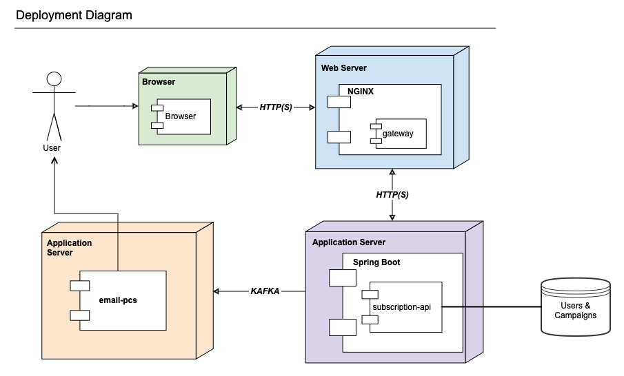
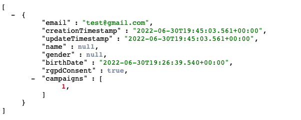

# Adidas coding challenge DEC21

 - Author: Ángel Cañal Muniesa
 - Date: June 30th 2022

## Introduction

The Adidas Code Challenge of Dec 2021 comprises the design, implementation and testing of a subscription system. This system should be able to store the subscription of a user to a campaign. Given so, there are 3 entities, Subscription, User and Campaign, with the fields proposed in the challenge.

The system has the ability of performing CR(U)D requests of the 3 entities. It can also send emails to all users in a campaign.

## Design decisions & assumptions

 - **Eventual consistency**: To increase the throughput of the system and to avoid sync bottlenecks, the system is build under an eventual consistency model, with asynchronous communications where possible.
 - **Tests**: Due to the reduced scope of the coding challenge, only a few tests have been developed. The selected tests are the ones considered more relevant (i.e. sending an email to the user, testing the controller, kafka consuming...). At least, one test of each type is provided, with both positive (happy path) and negative cases.
 - **Cached secure & idempotent requests**: GET requests are cached in the service using @Cacheable spring annotation to reduce the database overload.
 - **Exception handling**: All operations are considered susceptible to failure, so each one of them has a proper exception handling method. For example, a try-catch block, Controller Advices... 
 - **SLA & Scalability**: Although High Availability is considered to be out-of-scope, the solution is prepared for horizontal scalability, as the service only needs to know the broker (minimising temporal & spatial coupling), which is assumed to be in a HA state.
 - **GET all subscription**: To reduce the amount of data that needs to be retrieved from the database at once, the pagination is done on the users, rather than the campaigns. An assumption is that there are more users in a campaign than campaigns a user is subscribed to. This reduces the data volume transferred through rest and does not overload caches (see image below)
 - **Gateway**: The proposed public service is considered a gateway for multiple applications (e.g. backends for frontends) and is implemented via NGINX, although other approached such as Spring Cloud Gateway can be used. 

## What is considered to be 'out of scope'?

 - **Dependency injection design**: In a productive environment, the implementation and interface of a controller/service... should be independent. In this case it is not the case to reduce the complexity. This also allows to have the rest configuration in the controller interface, decoupling form the current implementation and allowing to read the documentation only, abstracting from the implementation. In the TMDAD link below you can see one of my previous projects with this kind of approach. 
 - **Kafka HA**: In a productive environment, Kafka MUST be in a high-availability mode, with at least 3 nodes.
 - **CORS**: The Cross-Origin Resource Sharing configuration has been partially included in the gateway but the services (APIs) shall be checked too. This is considered out of scope. 
 - **CA certs**: Security must be a priority while designing. In this case, it was a priority, but due to the reduced amount of time available and because it was also configured in a recent project (TMDAD), I redirect the reader to that project, linked below. The proposed security, implemented in TMDAD, is an HTTP/2+TLS combination for the HTTP requests and database encryption. 
 - **DB migration (Liquibase)**: The database and different schemas will need to evolve in the future, it is a fact. In this context is where AVRO (for Kafka) and Liquibase (for RDBMS) join the battle. In this project this has not been included but in the case of the first, it has been done in my Master Thesis/Dissertation, linked bellow in a collection of small articles.
 - **DLQ**: When something happens in relation to a Kafka record, it needs to be redirected to a DLQ for future processing (e.g. collect all the errors).
 - **Observability**: All systems MUST be observed (tracing, logging and monitoring), but in this case, this has been left out, although the default prometheus+actuator endpoint is available.
 - **Email service**: As suggested, the email sending feature is mocked in the email-pcs, just logging that an email has been sent.
 - **Load testing**: The performance tests needs to be run on a pre-productive environment, 

## What can be improved?
 - **Email sending**: An obvious improvement is removing the mocked service with a real one.
 - **AVRO**: Use an schema-registry or similar tool to store the schema of the topic/s and its evolution. Also, the AVSC generation must be based of POJO as the Master Thesis linked below.

## Other useful links.

 - **Master Thesis**: I have writen a collection of blog posts and LinkedIn posts available [here](http://langelp.net/blog/) 
 - **TMDAD** is a compulsory subject of the MSc in the University of Zaragoza. I have just finished that subject and the main project was a distributed chat application with a similar architecture. It is available in github [here](http://github.com/TMDAD-Chat/). I redirect the reader to the dev-env project where the security is configured and to the message encryption converter [here](https://github.com/TMDAD-Chat/message-receiver-api/blob/484281eb9c5080c1162274f6e445acae10a25462/src/main/java/es/unizar/tmdad/repository/converter/AttributeEncryptor.java) and [configured here](https://github.com/TMDAD-Chat/message-receiver-api/blob/main/src/main/java/es/unizar/tmdad/repository/entity/MessageEntity.java). In case it is necessary, the documentation of this project can be provided (Spanish only).

## How to run the component?
Running the services is simple, you only need to run `docker compose up --detach` (MacOS) or `docker-compose up --detach` (Linux) in the root folder 

## CI/CD

Although not required, I propose a CI/CD pipeline with the following steps, similar to the image above. That image is the pipeline of my Master Thesis.
 - Project build
 - Project tests run
 - Code Quality analysis (i.e. SonarQube)
 - Docker image generation & push to registry
 - Automatic deployment artefact generation (e.g. K8S yml)
 - Deployment to the desired environment (Stage, PRE, PROD...)
 - Optionally, the pipeline can send messages to a Slack channel, emails or both in case of success or error.

The code of these pipelines must be stored in a repo, following the Pipelines as Code guidelines. One example is the Jenkins Templating Library, used to implement the above pipeline.